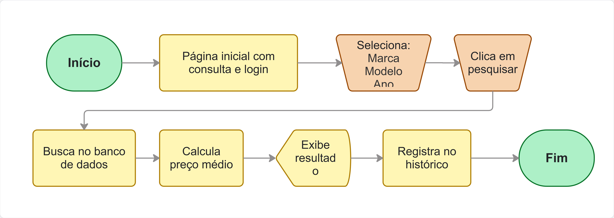
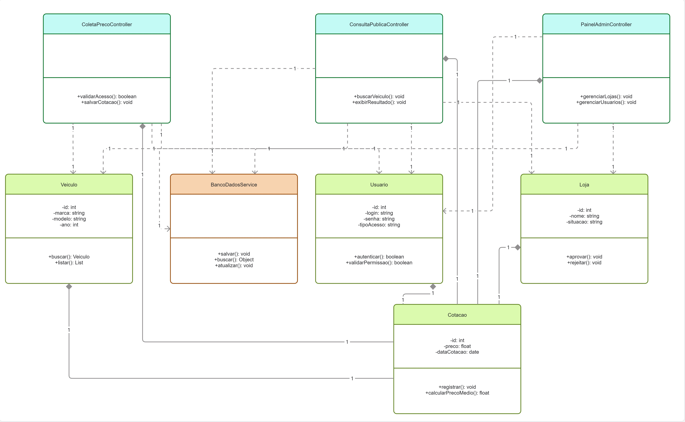

# SIVEAUTO - Sistema de Cotação de Veículos

## 📄 Sobre o Projeto
Sistema monolítico em **Python** para consulta e coleta de preços de veículos, com módulos de administração e pesquisa de mercado.

---

## 🏗️ Entrega 1: Modelagem e Arquitetura

### 1. Fluxos de Processo
**Fluxo do Usuário (Consulta Pública):**

**Fluxo do Administrador (Gestão):**

### 2. Banco de Dados
**Modelo de Entidade-Relacionamento (DER):**

### 3. Estrutura de Código
**Diagrama de Classes:**

---

## 🛠️ Tecnologias
* **Linguagem:** Python 3.12+
* **Interface:** Streamlit
* **Banco:** SQLite
* **Testes:** Pytest (TDD)