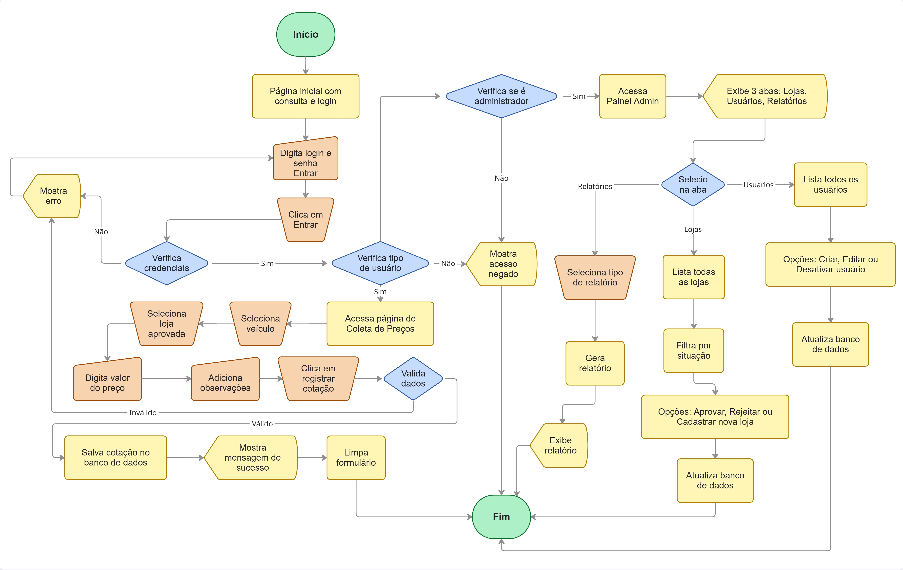
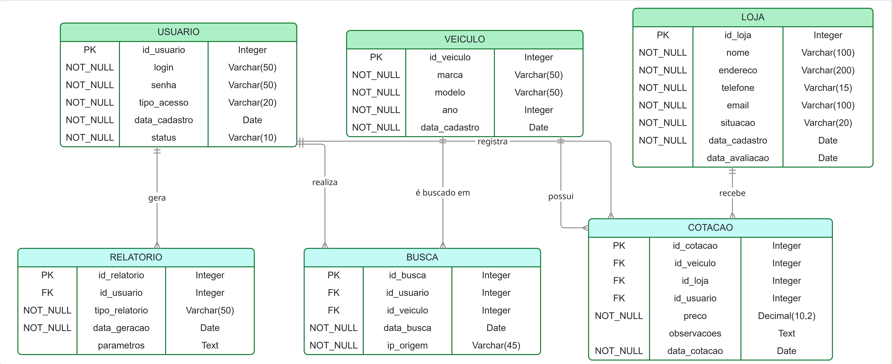
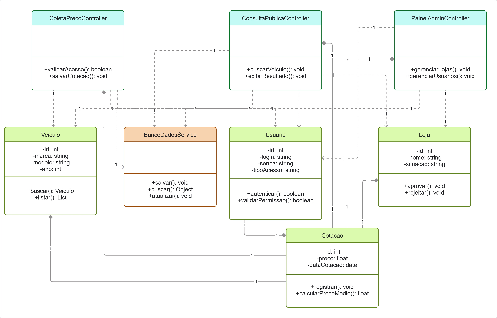

# 📘 SIVEAUTO – Documentação Técnica do Projeto

> **Entrega 1: Planeamento, Modelação e Arquitetura**
>
> * **Projeto:** SIVEAUTO (Sistema de Cotação de Veículos e Auditoria Técnica)
> * **Desenvolvedor:** Gabriel H. S. Oliveira
> * **Data da Entrega:** 10 de Fevereiro de 2026
> * **Versão:** 1.0.0 (Estrutura Inicial)
> * **Jira:** https://ghso.atlassian.net/jira/software/projects/PS/list?jql=project+%3D+PS+ORDER+BY+created+DESC&atlOrigin=eyJpIjoiN2JmNWJjNTljOTJmNDM1ZmI0OWVjZDc1ZjMxYmYwNGQiLCJwIjoiaiJ9

---

## 1. Visão Geral e Objetivos
O **SIVEAUTO** é uma solução de software desenvolvida para automatizar a consulta, recolha e auditoria de preços de veículos no mercado nacional. O sistema integra uma interface pública de consulta com um painel administrativo seguro.

### 🎯 Objetivos do Sistema
1.  **Consulta Pública:** Fornecer uma ferramenta performante para consulta de preço médio (Base FIPE e Mercado).
2.  **Gestão de Cotações:** Permitir o registo de preços reais encontrados em lojas parceiras por pesquisadores.
3.  **Auditoria e Compliance:** Garantir a imutabilidade dos registos de busca e alterações de preço para fins de auditoria.

---

## 2. Arquitetura da Solução

### 🛠️ Stack Tecnológica
A seleção tecnológica visa a manutenibilidade e a rapidez de desenvolvimento (Rapid Application Development).

| Componente | Tecnologia | Justificação Técnica |
| :--- | :--- | :--- |
| **Backend/Core** | Python 3.12+ |
| **Frontend** | Streamlit |
| **Base de Dados** | SQLite |
| **QA / Testes** | Pytest |
| **Análise** | Pandas |

### 📂 Estrutura de Diretórios
O projeto segue o padrão MVC (Model-View-Controller) adaptado:
* `/src/controllers`: Regras de negócio, validação de dados e controlo de fluxo.
* `/src/models`: Definição das classes de dados e ORM.
* `/src/views`: Interfaces de utilizador (Páginas do Streamlit).
* `/tests`: Bateria de testes automatizados (Unitários e Integração).

---

## 3. Artefatos de Modelação (Entrega Visual)
Esta secção documenta a concretização das tarefas de modelação (**Jira PS-5** e **PS-8**).

### 3.1 Fluxos de Processo (User Flows)
Mapeamento da jornada do utilizador e das rotas do sistema.

* **Fluxo do Utilizador (Consulta Pública):**
  Jornada de pesquisa anónima, seleção de veículo e visualização de resultados.
  

* **Fluxo Administrativo (Gestão):**
  Processos de login, gestão de lojas parceiras e aprovação de cotações.
  

### 3.2 Modelo de Dados (DER)
Estrutura relacional normalizada do banco de dados SQLite.

**Dicionário de Dados Resumido:**
* `USUARIOS`: Credenciais e perfis (`admin`, `pesquisador`).
* `VEICULOS`: Catálogo de referência importado da Tabela FIPE.
* `LOJAS`: Parceiros comerciais (Status: Pendente/Aprovada/Rejeitada).
* `COTACOES`: Tabela transacional com preços coletados e data.
* `LOGS`: Tabela de auditoria para registo de todas as operações de busca.

### 3.3 Diagrama de Classes
Arquitetura de código orientada a objetos, separando Entidades e Controladores.

---

## 4. Regras de Negócio e Requisitos (TDD)
Critérios de aceitação implementados conforme a **Documentação Técnica (TDD)**:

1.  **Hierarquia de Acesso:**
    * Apenas utilizadores com perfil `ADMIN` podem cadastrar, aprovar ou inativar lojas.
    * Utilizadores `PESQUISADOR` têm permissão exclusiva para inserir novas cotações de preços.

2.  **Validação de Dados (Data Integrity):**
    * O sistema deve rejeitar a inserção de cotações com valores negativos ou iguais a zero.
    * **Alerta de Desvio:** O sistema deve marcar automaticamente (flag) cotações que apresentem um desvio superior a **20%** em relação à média FIPE.

3.  **Auditoria:**
    * É estritamente proibida a exclusão física de registos de histórico (Logs). Deve ser aplicado *Soft Delete* ou imutabilidade total.

---
